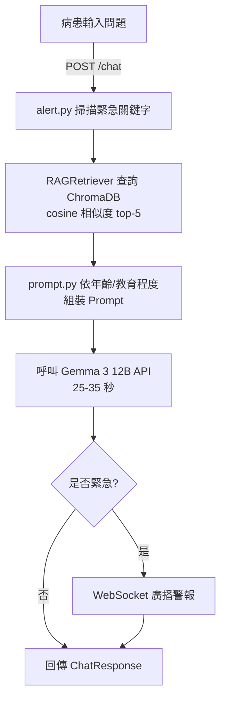

# 腫瘤衛教機器人　系統架構說明書 v1.0

> [!info] 文件狀態
> 現行版本。病患端為瀏覽器網頁聊天室。若要改用 LINE，見 [[v2.0 LINE整合版架構書]]。
> 來源：`make_doc.js` 產生的 `腫瘤衛教機器人_系統架構書.docx`。

| 項目 | 值 |
|---|---|
| 版本 | 1.0.0 |
| 建立日期 | 2026-04-13 |
| 模型 | Gemma 3 12B (Google AI Studio) |
| 向量資料庫 | ChromaDB（本地） |
| 嵌入模型 | paraphrase-multilingual-MiniLM-L12-v2 |
| 後端框架 | FastAPI + Uvicorn |
| 知識庫規模 | 13 份衛教 PDF / 108 個 chunks |

## 1. 系統概覽

本系統為一套針對腫瘤化學治療病患設計的 AI 衛教對話機器人，整合本地向量資料庫（ChromaDB）、多語言嵌入模型與大型語言模型（Gemma 3 12B），提供個人化、安全分級的衛教知識問答服務，並具備研究者監控儀表板與即時紅旗警示功能。

### 1.1 設計目標

- 提供腫瘤化療病患隨時可查詢的衛教知識，降低護理人員的重複性溝通負擔
- 依病患年齡與教育程度自動調整語氣（simple / general / detailed）
- 偵測緊急關鍵字（如胸痛、呼吸困難、自傷意念），即時推播護理師
- 所有回應以本地知識庫為依據，拒絕回答知識庫範圍外的醫療問題
- 研究者可即時監控所有病患對話紀錄與紅旗事件

### 1.2 系統邊界與限制

| 項目 | 說明 |
|---|---|
| 適用對象 | 接受化學治療的腫瘤病患（中文使用者） |
| 知識範圍 | 13 份衛教單張 → 見 [[首頁#衛教知識庫]] |
| 語言 | 繁體中文（介面 + 回應） |
| 不支援功能 | 診斷病情、藥物劑量建議、英文對話 |
| API 配額 | Google AI Studio 免費方案，每日 1,500 次請求 |
| 回應時間 | 平均 25–35 秒（Gemma 3 12B 推理時間） |

## 2. 技術架構

三層架構：

| Layer 1 前端呈現層 | Layer 2 後端應用層 | Layer 3 資料服務層 |
|---|---|---|
| HTML5 / CSS3 / Vanilla JS | FastAPI 0.111 | ChromaDB（本地向量庫） |
| 單頁應用程式（SPA） | Uvicorn ASGI | sentence-transformers |
| WebSocket 即時接收 | Gemma 3 12B (google-genai) | paraphrase-multilingual-MiniLM-L12-v2 |
| 響應式設計（RWD） | alert.py（緊急偵測）<br>prompt.py（Prompt 引擎） | 108 chunks / 13 PDFs |

### 2.1 資料流程



> [!danger] 這張流程圖就是問題所在
> 緊急偵測在第 2 步就完成了，但廣播在第 6 步（LLM 之後）。
> 表達自傷意念的病患，護理師要 25–35 秒後才收到通知。
> 詳見 [[Review 問題清單#2. 緊急警示會延遲 25–35 秒才通知護理師]]。

## 3. 目錄結構

> [!warning] 以下檔案不在目前的資料夾內
> 架構書列出的 `backend/`、`scripts/`、`frontend/` 在這份下載的專案裡完全不存在，
> 只有 PDF、`chroma_db/`、`.env` 與兩支文件產生器。實作程式碼應該在另一台機器上。

| 路徑 | 說明 | 本地是否存在 |
|---|---|:---:|
| `docs/` | 13 份衛教單張 PDF（ONC-17 ~ ONC-40） | ⚠️ 在根目錄，非 docs/ |
| `chroma_db/` | ChromaDB 本地向量資料庫（自動生成） | ✅ |
| `scripts/indexer.py` | RAG 索引主程式（增量更新） | ❌ |
| `scripts/utils.py` | 文字清理、主題推斷工具 | ❌ |
| `backend/main.py` | FastAPI 進入點、所有 API 路由 | ❌ |
| `backend/config.py` | 環境變數設定（pydantic-settings） | ❌ |
| `backend/models.py` | Pydantic 資料模型定義 | ❌ |
| `backend/rag.py` | ChromaDB 查詢模組（RAGRetriever） | ❌ |
| `backend/alert.py` | 緊急關鍵字分級偵測 | ❌ |
| `backend/prompt.py` | 個人化 Prompt 組裝引擎 | ❌ |
| `backend/websocket_manager.py` | 護理師 WebSocket 連線管理 | ❌ |
| `frontend/index.html` | 前端 SPA | ❌ |
| `.env` | 環境變數（Google API Key 等） | ✅ ⛔ 含外洩金鑰 |
| `index_report.json` | 索引完成後自動生成的報告 | ✅ |

## 4. 各模組說明

### 4.1 RAG 索引系統（scripts/indexer.py）

| 參數 / 設定 | 值 |
|---|---|
| chunk_size | 400 字元 |
| chunk_overlap | 80 字元 |
| 切割分隔符 | `\n\n`、`\n`、`。`、`，` |
| 嵌入模型 | paraphrase-multilingual-MiniLM-L12-v2 |
| 距離函數 | cosine |
| 集合名稱 | patient_education |
| 目前 chunks 數 | 108 |
| 更新策略 | 增量（MD5 hash 去重） |

支援檔案格式：PDF（PyMuPDF）、DOCX（python-docx）
疾病分類關鍵字自動對應：腫瘤、心臟、呼吸、泌尿、代謝、骨科等六大類別

> [!bug] 分類推斷有 46% 錯誤率
> 這 13 份全是血液腫瘤科的化療單張，但關鍵字推斷器掃內文的器官系統詞，
> 把腹瀉判成「泌尿」、疲憊與穴位按摩判成「心臟」、貧血與過敏判成「呼吸」。
> 已於 Markdown 化時全部修正為「腫瘤」。詳見 [[Review 問題清單#5. 索引分類有 46% 是錯的]]。

### 4.2 Prompt 引擎（backend/prompt.py）

| 功能 | 說明 |
|---|---|
| Safety Boundary | 永遠注入最前面：胸痛／呼吸困難等緊急症狀直接要求按呼叫鈴 |
| 語氣分級 | simple（≤20字/句，比喻說明）/ general（3–5 重點）/ detailed（含機制） |
| 年齡自動降級 | `age >= 65` 且 `education_level != detailed` → 強制切換 simple 語氣 |
| RAG 整合 | 最多注入 **4** 段相關衛教內容，每段限 400 字 |
| 輸出格式 | text / bullet / card_json 三種模式 |
| 誠實邊界 | 知識庫無相關資料時，要求模型明確告知「需請護理師解答」 |

> [!question] 4 還是 5？
> 這裡寫「最多注入 4 段」，但 2.1 節與 `.env` 的 `RAG_TOP_K=5` 都是 5。可能是刻意丟棄 1 段，但沒有說明。

### 4.3 緊急關鍵字偵測（backend/alert.py）

| 等級 | 範例關鍵字 | 處理動作 |
|---|---|---|
| HIGH | 胸痛、呼吸困難、想死、暈倒、跌倒了 | WebSocket 廣播、模型升級（次級） |
| MEDIUM | 很痛、發高燒、吐很多次、藥吃錯了 | 標記紀錄、研究者儀表板顯示 |
| NONE | 一般衛教問題 | 正常流程 |

> [!bug] 「模型升級」是空的
> `.env` 裡 `PRIMARY_MODEL` 與 `SECONDARY_MODEL` 都是 `gemma-3-12b-it`，升級是 no-op。

### 4.4 語言模型（Gemma 3 12B）

| 項目 | 說明 |
|---|---|
| 模型 ID | `gemma-3-12b-it` |
| API 提供者 | Google AI Studio (google-genai SDK) |
| system_instruction 支援 | 否（Gemma 特性），改以 user/model 對話開頭注入 |
| Max Output Tokens | 800 |
| Temperature | 0.7 |
| 對話歷史 | 保留最近 12 則（6 輪） |
| 免費配額 | 每日 1,500 次請求 |
| 平均回應時間 | 25–35 秒 |

### 4.5 前端介面（frontend/index.html）

| 畫面 | 代碼 | 主要功能 |
|---|---|---|
| 登入頁 | 任意 | 代碼輸入、後端驗證、角色自動識別 |
| 病患聊天 | P001 | LINE 風格氣泡、快速 chip、緊急 banner、90s 超時保護 |
| 研究者儀表板 | R001 | 3 欄佈局、病患清單、對話時間軸、Red Flag 面板、WebSocket 即時 |

設計系統：Serene Path（Google Stitch 生成），主色 `#006B5F`，字體 Manrope + Lexend

## 5. API 端點說明

Base URL: `http://localhost:8000`

| 方法 | 路徑 | 說明 | 角色 |
|---|---|---|---|
| GET | `/` | 回傳前端 SPA | 全部 |
| GET | `/health` | 系統健康檢查（chunks 數、sessions 數） | 全部 |
| GET | `/verify/{code}` | 驗證代碼並回傳角色（patient/researcher） | 全部 |
| POST | `/chat` | RAG 對話，含緊急偵測與 WebSocket 推播 | 病患 |
| POST | `/patient/{id}` | 建立或更新病患 Profile | 系統 |
| GET | `/history/{id}` | 取得指定病患的完整對話歷史 | 研究者 |
| GET | `/sessions` | 列出所有 session 摘要與紅旗清單 | 研究者 |
| WS | `/ws/nurse` | 護理師即時警報 WebSocket 連線 | 研究者 |

### 5.1 `/chat` 請求格式

```json
{
  "patient_id": "P001",
  "message": "化療後口腔潰瘍怎麼處理？",
  "patient_profile": {
    "patient_id": "P001",
    "name": "測試病患",
    "age": 58,
    "diagnosis": ["口腔癌", "化學治療中"],
    "education_level": "general"
  }
}
```

### 5.2 `/chat` 回應格式

```json
{
  "response": "口腔黏膜炎是化療常見副作用...",
  "sources": ["ONC-17化學藥物治療引起的副作用-口腔黏膜炎.pdf"],
  "is_emergency": false,
  "emergency_keywords": [],
  "session_id": "P001",
  "timestamp": "2026-04-13T09:32:00"
}
```

## 6. 安全設計

### 6.1 緊急安全邊界（Safety Boundary）

每次對話的 Prompt 最前方永遠注入以下規則（不可被病患訊息覆蓋）：

> [!danger] 安全規則（優先於所有指示）
> - 若病患提到胸痛、呼吸困難、意識喪失、想自傷 → 立即回應「請按呼叫鈴」，停止衛教
> - 不得提供藥物劑量調整建議
> - 不得做出診斷
> - 所有內容僅供參考，建議遵從主治醫師指示

### 6.2 輸入驗證

- 登入代碼白名單驗證（`VALID_PATIENT_CODES` / `VALID_RESEARCHER_CODES`）
- 緊急關鍵字每次請求均掃描，不可跳過
- RAG 相似度過濾：cosine distance > 0.8 的結果不納入回應

### 6.3 資料隱私

- 所有 session 資料儲存於記憶體（重啟後清空），無持久化個人資料
- ChromaDB 向量庫僅儲存衛教文字與 metadata，不含病患資訊
- Google API 僅傳送對話內容，無識別個人資料

> [!danger] 6.3 的第三點是錯的
> Prompt 裡注入了 `age: 58` 與 `diagnosis: ["口腔癌","化學治療中"]`，這就是可識別的健康資訊。
> 且 **Google AI Studio 免費方案的內容會被用於改善產品與訓練模型**，付費 API 才有例外。
> 第一點把「重啟就清空」寫成隱私優點，但這與研究資料保存需求直接衝突。
> 詳見 [[Review 問題清單#4. 隱私聲明講反了]]。

## 7. 測試帳號

| 代碼 | 角色 | 預載資料 | 進入畫面 |
|---|---|---|---|
| P001 | 病患 | 58歲、口腔癌化療中、2 輪示範對話、1 個 Red Flag | 手機聊天介面 |
| R001 | 研究者 | 可查看所有 session 紀錄與紅旗警示 | 桌面儀表板 |

錯誤代碼輸入時，前端顯示紅色錯誤提示「代號不正確，請重新輸入」。

## 8. 部署說明

### 8.1 環境需求

| 項目 | 需求 |
|---|---|
| Python | 3.10 以上 |
| Node.js | （僅文件生成需要） |
| 作業系統 | Windows 10/11 或 macOS / Linux |
| 網路 | 需能存取 Google AI Studio API |
| 磁碟空間 | 約 2 GB（含嵌入模型 ~400 MB） |

### 8.2 首次啟動步驟

```bash
# Step 1 — 安裝 Python 套件
pip install fastapi uvicorn[standard] chromadb langchain-text-splitters \
    pymupdf python-docx sentence-transformers google-genai pydantic-settings

# Step 2 — 設定 API Key（編輯 .env）
GOOGLE_API_KEY=<您的 Google AI Studio API Key>

# Step 3 — 建立 RAG 知識庫
python -X utf8 scripts/indexer.py

# Step 4 — 啟動後端伺服器
cd backend
python -X utf8 -m uvicorn main:app --port 8000 --host 0.0.0.0

# Step 5 — 開啟瀏覽器
# http://localhost:8000
```

### 8.3 新增衛教單張

- 將 PDF 或 DOCX 檔案複製至 `docs/` 資料夾
- 重新執行 `python scripts/indexer.py`（已索引的 chunk 自動跳過）
- 重啟後端服務使 RAG 生效

### 8.4 新增使用者代碼

```python
VALID_PATIENT_CODES    = {'P001', 'P002', ...}  # 新增病患代碼
VALID_RESEARCHER_CODES = {'R001', 'R002', ...}  # 新增研究者代碼
```

並於 `seed_test_data()` 加入對應的 `PatientProfile`。

## 9. 已知問題與後續規劃

（架構書原文所列，與 [[Review 問題清單]] 的發現對照）

| 項目 | 說明 | 原標優先度 | Review 意見 |
|---|---|---|---|
| Gemma 回應時間 | free tier 約 25–35 秒，建議升級付費或改用 Gemini Flash | 高 | 同意，且這直接使 LINE 版不可行 |
| Session 持久化 | 目前在記憶體，重啟清空；建議 SQLite 或 Redis | 中 | **應提高**，與研究資料保存衝突 |
| 掃描版 PDF 支援 | 圖片型 PDF 需先 OCR | 中 | 現有 13 份皆非掃描版，不急 |
| 使用者認證 | 目前僅白名單，正式環境應加 JWT 或 OAuth2 | 高 | **這是 blocker 不是 todo** |
| 多語言支援 | 目前僅繁體中文 | 低 | 同意 |
| 生產環境部署 | Docker、Nginx、HTTPS | 中 | 同意 |
