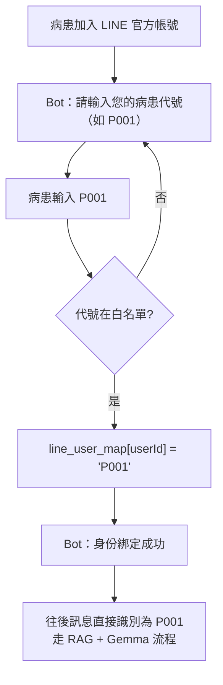

# AI 腫瘤衛教機器人　LINE Bot 整合版系統架構書 v2.0

> [!info] 文件狀態
> 規劃文件。病患端改用 LINE Bot，研究者端保留 [[v1.0 系統架構書]] 的瀏覽器儀表板。
> 來源：`make_doc_line.js` 產生的 `腫瘤衛教機器人_LINE整合版系統架構書.docx`。

> [!danger] 動工前必讀
> 第五章的 webhook 程式碼**跑不起來**，而且整個同步回覆設計與 LINE 平台的時限不相容。
> 見本頁 [[#⛔ 第五章的三個致命問題]]。

## 第一章　整合動機與目標

### 1.1 為什麼要串接 LINE？

原有系統的病患介面為網頁版聊天室，病患需打開瀏覽器並記住網址才能使用。對年長病患而言，學習成本偏高且黏著度低。LINE 在台灣的普及率超過 90%，幾乎每位病患手機中都已安裝，透過官方帳號（LINE Bot）提供服務可大幅降低使用門檻。

| 面向 | 原有網頁版 | LINE Bot 整合版 |
|---|---|---|
| 病患入口 | 需開啟瀏覽器、輸入網址 | 點開 LINE 官方帳號即可對話 |
| 學習成本 | 需學習新介面 | 沿用熟悉的 LINE 操作 |
| 通知推播 | 無主動推播 | 可主動推送衛教提醒 |
| 身份識別 | 輸入代號 P001 | 綁定一次後，自動識別身份 |
| 研究者介面 | 瀏覽器網頁（保留不動） | 瀏覽器網頁（保留不動） |

### 1.2 整合目標

- 病患端：完全改用 LINE Bot，移除原本的網頁聊天介面
- 研究者端：保留原有瀏覽器儀表板（完全不需修改）
- 核心邏輯：RAG、Prompt Engine、緊急關鍵字偵測全部複用
- 新增功能：LINE userId 與病患代號綁定機制、Webhook 接收端點

## 第二章　整體系統架構

### 2.1 高階架構圖

```mermaid
graph TD
    subgraph 病患 LINE Bot 流
        A[病患 LINE App] -->|HTTPS POST 含簽名| B[LINE Platform]
        B -->|HTTPS POST /webhook| C[FastAPI /webhook]
        C --> D[驗簽 → 身份查找 → chat 邏輯]
        D --> E[RAG + Prompt + Gemma API]
        E --> F[LINE Reply API] --> A
    end
    subgraph 緊急事件流
        D -.偵測到緊急關鍵字.-> G[WebSocket 推播] --> H[研究者儀表板紅燈]
    end
    subgraph 研究者瀏覽器流（不變）
        I[研究者瀏覽器] -->|GET /sessions, /history| J[儀表板顯示對話紀錄]
    end
```

### 2.2 元件職責對照

| 元件 | 職責 | 是否需修改 |
|---|---|---|
| LINE Platform | 接收病患訊息、轉發 Webhook、發送回覆 | 外部服務，無需修改 |
| FastAPI `/webhook` | 驗證簽名、解析事件、呼叫 chat 邏輯、回覆 LINE | 新增 |
| `line_user_map` | LINE userId ↔ 病患代號綁定表 | 新增（記憶體 dict） |
| `/chat` 核心邏輯 | RAG 查詢 + Prompt 組裝 + Gemma 呼叫 | 不需修改，抽成共用函式 |
| `alert.py` | 緊急關鍵字偵測 | 不需修改 |
| `rag.py` | 向量檢索衛教文件 | 不需修改 |
| `prompt.py` | 個人化 Prompt 組裝 | 不需修改 |
| `websocket_manager.py` | WebSocket 推播護理師警示 | 不需修改 |
| `frontend/index.html` 研究者端 | 對話紀錄儀表板、Red Flag 顯示 | 不需修改 |
| `frontend/index.html` 病患端 | 原有聊天介面（停用） | 移除或隱藏 |

## 第三章　LINE Messaging API 申請與設定

### 3.1 申請流程

1. **登入 LINE Developers Console** — 前往 developers.line.biz，以個人 LINE 帳號登入
2. **建立 Provider** — 點選「Create a new provider」，輸入醫院或研究團隊名稱（例：ONC-Education-Team）
3. **建立 Messaging API Channel** — 在 Provider 頁面點「Create a new channel」→ 選「Messaging API」，填寫 Channel name（衛教小幫手）、Category（醫療 / Healthcare）
4. **取得金鑰** — Basic settings 頁籤複製 Channel Secret；Messaging API 頁籤點「Issue」取得 Channel Access Token（長期）
5. **設定 Webhook URL** — Messaging API 頁籤 → Webhook settings → 填入 `https://{你的公開網域}/webhook`，勾選「Use webhook」，點「Verify」確認連線
6. **關閉自動回覆訊息** — LINE Official Account Manager → 回應設定 → 關閉「自動回覆」和「加入好友的歡迎訊息」（改由程式控制）

### 3.2 取得的金鑰資訊

> [!important]
> Channel Secret 和 Channel Access Token 不可洩漏。請勿上傳至 GitHub 或以明文分享。存放於伺服器 `.env` 檔案中。

| 金鑰名稱 | 用途 | 存放位置 |
|---|---|---|
| Channel Secret | 驗證 Webhook 請求是否來自 LINE 平台（HMAC-SHA256 簽名驗證） | `.env` `LINE_CHANNEL_SECRET` |
| Channel Access Token | 呼叫 LINE Reply API 發送回覆訊息 | `.env` `LINE_CHANNEL_ACCESS_TOKEN` |

> [!danger] 這條警告本身沒被遵守
> `.gitignore` 確實排除了 `.env`，但 `.env` 連同 Google API Key 還是隨資料夾上了雲端硬碟。
> `.gitignore` 只擋 git，不擋 Drive。見 [[Review 問題清單#1. API Key 外洩]]。

## 第四章　公開 HTTPS 網址取得方式

LINE Webhook 要求接收端必須是有效的 HTTPS 公開網址，localhost 無法使用。

| 階段 | 工具 | 費用 | 優缺點 |
|---|---|---|---|
| 開發 / 測試 | ngrok | 免費（有限制） | 最快速，重啟後網址會變；適合個人開發測試 |
| 展示 / 驗收 | ngrok 固定網域（付費）或 Render.com 免費方案 | 低 | 穩定網址，適合給醫療團隊展示 |
| 正式上線 | Railway / GCP Cloud Run / Azure App Service | 依用量計費 | 最穩定、可綁定自訂網域 |

### 4.1 開發期使用 ngrok

```bash
ngrok config add-authtoken <你的 authtoken>
ngrok http 8000
# 複製 Forwarding 網址填入 LINE Console：
# https://xxxx-xx-xxx-xxx-xx.ngrok-free.app/webhook
```

> [!note]
> 每次重新啟動 ngrok，網址都會改變（免費版），需重新填入 LINE Console。

### 4.2 雲端部署（正式上線建議）

以 Railway 為例：

- 將專案推送至 GitHub Repository
- 在 railway.app 連結 GitHub Repo，Railway 自動偵測 Python 環境
- 在 Railway 的 Variables 面板設定 `.env` 中的所有環境變數
- Railway 自動提供 HTTPS 網址，直接填入 LINE Webhook URL
- 啟動指令：`uvicorn backend.main:app --host 0.0.0.0 --port $PORT`

## 第五章　後端程式修改說明

### 5.1 新增套件

```
line-bot-sdk>=3.0.0
```

### 5.2 環境變數新增（.env）

| 變數名稱 | 說明 |
|---|---|
| `LINE_CHANNEL_SECRET` | Webhook 簽名驗證金鑰，取自 LINE Console Basic settings |
| `LINE_CHANNEL_ACCESS_TOKEN` | 呼叫 Reply API 用的 Access Token，取自 LINE Console Messaging API |

### 5.3 核心邏輯重構（抽成共用函式）

```python
async def process_chat(patient_id: str, message: str) -> str:
    """RAG + Prompt + Gemma 呼叫，回傳回覆文字"""
    alert = detect_emergency(message)
    profile = patient_profiles.get(patient_id)
    rag_docs = retriever.query(message)
    system_prompt = build_prompt(profile, rag_docs)
    # ... Gemma 呼叫 ...
    if alert.is_emergency:
        await manager.broadcast_alert({...})
    return reply
```

### 5.4 LINE Webhook 端點

```python
from linebot.v3 import WebhookHandler
from linebot.v3.messaging import (
    Configuration, ApiClient, MessagingApi,
    ReplyMessageRequest, TextMessage)
from linebot.v3.webhooks import MessageEvent, TextMessageContent

line_config = Configuration(access_token=settings.LINE_CHANNEL_ACCESS_TOKEN)
handler = WebhookHandler(settings.LINE_CHANNEL_SECRET)
line_user_map: dict[str, str] = {}   # userId -> patient_id

@app.post('/webhook')
async def line_webhook(request: Request):
    signature = request.headers.get('X-Line-Signature', '')
    body = await request.body()
    handler.handle(body.decode(), signature)  # 簽名驗證
    return 'OK'
```

### 5.5 病患綁定與訊息處理邏輯

```python
@handler.add(MessageEvent, message=TextMessageContent)
def handle_message(event: MessageEvent):
    user_id = event.source.user_id
    text = event.message.text.strip()

    # 尚未綁定：要求輸入病患代號
    if user_id not in line_user_map:
        if text.upper() in VALID_PATIENT_CODES:
            line_user_map[user_id] = text.upper()
            reply = "綁定成功！您現在可以開始提問。"
        else:
            reply = "請先輸入您的病患代號（例如：P001）"
    else:
        patient_id = line_user_map[user_id]
        # 呼叫共用 process_chat（需用 asyncio.run）
        reply = asyncio.run(process_chat(patient_id, text))

    with ApiClient(line_config) as api_client:
        MessagingApi(api_client).reply_message(
            ReplyMessageRequest(
                reply_token=event.reply_token,
                messages=[TextMessage(text=reply)]))
```

### ⛔ 第五章的三個致命問題

> [!failure] 1. `asyncio.run()` 在事件迴圈內呼叫 → 立刻拋 RuntimeError
> `RuntimeError: asyncio.run() cannot be called from a running event loop`
> `handle_message` 是同步函式，被 `handler.handle()` 同步呼叫，而 `handler.handle()` 又在
> `async def line_webhook` 內執行。**第一則病患訊息就會炸。**

> [!failure] 2. 25–35 秒的 Gemma 呼叫會同步阻塞整個事件迴圈
> 期間研究者儀表板、`/sessions`、WebSocket 推播全部卡死 —— 包含緊急警示本身。

> [!failure] 3. 同步回覆與 LINE 的時限不相容
> LINE 期望 webhook 立即回 200，等 30 秒會被判逾時並**重送**（造成重複處理與重複計費）；
> 且 reply token 效期很短，30 秒後回覆很可能已經失效。

> [!success] 正確架構
> ```python
> @app.post('/webhook')
> async def line_webhook(request: Request, bg: BackgroundTasks):
>     body = await request.body()
>     verify_signature(body, request.headers.get('X-Line-Signature', ''))
>     for event in parse_events(body):
>         bg.add_task(handle_event_async, event)   # 丟背景
>     return 'OK'                                   # 立刻回 200
> ```
> 背景任務改用 **Push API**（`push_message`）而非 Reply API，因為 reply token 可能已過期。
> 緊急情況則在 `detect_emergency` 之後**立即**用 Push 回覆固定文字並廣播，完全不進 LLM。

## 第六章　病患身份識別設計

### 6.1 綁定流程



> [!danger] 任何人輸入 P001 都能綁定成該病患
> 這不是身份「認證」，只是身份「宣稱」。陌生人加入官方帳號後輸入 `P001`，
> 就能以該病患身分提問，並汙染研究者看到的對話紀錄。
> 至少要改成一次性綁定碼（綁定後失效），由護理師當面發給病患。

### 6.2 儲存方式比較

| 方式 | 實作複雜度 | 重啟後保留 | 適用情境 |
|---|---|---|---|
| 記憶體 dict（目前採用） | 低 | 否（重啟需重新綁定） | 開發測試、原型展示 |
| JSON 檔案持久化 | 低 | 是 | 小型部署、不需資料庫 |
| SQLite 資料庫 | 中 | 是 | 正式上線建議方案 |
| PostgreSQL / MySQL | 高 | 是 | 多機部署、大規模使用 |

## 第七章　API 端點總覽（更新版）

| 方法 | 路徑 | 呼叫者 | 說明 | 是否新增 |
|---|---|---|---|---|
| POST | `/webhook` | LINE Platform | 接收 LINE 事件，驗簽後處理訊息 | 新增 |
| POST | `/chat` | （內部共用） | RAG + Gemma 核心邏輯 | 重構為共用函式 |
| GET | `/verify/{code}` | 研究者瀏覽器 | 驗證登入代號（R001） | 不變 |
| GET | `/sessions` | 研究者瀏覽器 | 取得所有 session 摘要與 Red Flag | 不變 |
| GET | `/history/{patient_id}` | 研究者瀏覽器 | 取得指定病患完整對話紀錄 | 不變 |
| POST | `/patient/{id}` | 管理者 | 新增 / 更新病患資料 | 不變 |
| WS | `/ws/nurse` | 研究者瀏覽器 | 接收緊急警示 WebSocket 推播 | 不變 |
| GET | `/health` | 監控工具 | 系統健康狀態檢查 | 不變 |

### 7.1 `/webhook` 端點規格

| 項目 | 說明 |
|---|---|
| 方法 | POST |
| URL | `https://{domain}/webhook` |
| 呼叫者 | LINE Platform（由 LINE 伺服器自動呼叫，非人工呼叫） |
| Header | `X-Line-Signature: {HMAC-SHA256 簽名字串}` |
| Body | JSON 格式 LINE Events 陣列 |
| 回應 | 200 OK（純文字 `'OK'`） |
| 簽名驗證失敗 | 拋出 `InvalidSignatureError`，LINE SDK 自動返回 400 |

## 第八章　安全設計

### 8.1 Webhook 簽名驗證

- 取出 `X-Line-Signature` header
- 計算 Request Body 的 HMAC-SHA256（使用 Channel Secret 為金鑰）
- 比對兩者是否一致，不一致則拋出 `InvalidSignatureError`

### 8.2 病患代號驗證

綁定時驗證輸入的代號必須存在於 `VALID_PATIENT_CODES` 白名單，避免任意字串被當作有效病患 ID 注入。

### 8.3 AI 安全邊界（不變）

| 規則 | 內容 |
|---|---|
| 不診斷 | Bot 不做疾病診斷，遇診斷相關問題引導就醫 |
| 不調整藥量 | 嚴禁建議增減藥物劑量或停藥 |
| 緊急關鍵字 | 偵測到高風險關鍵字立即回覆「請按呼叫鈴」並觸發 WebSocket 警示 |
| 知識邊界 | 僅依據 RAG 檢索到的衛教文件回答，資料不足時誠實說明 |

> [!warning] 「立即」在目前的實作裡不成立
> 見 [[Review 問題清單#2. 緊急警示會延遲 25–35 秒才通知護理師]]。

### 8.4 LINE 訊息長度限制

> [!note]
> LINE 單則訊息最大 5000 字元。Gemma 回覆若超過此限制，需在 `process_chat()` 中加入截斷邏輯
> （建議限制 `max_output_tokens=800` 並加入安全截斷）。

## 第九章　變更影響範圍總整理

| 檔案 / 元件 | 變更類型 | 具體變更內容 |
|---|---|---|
| `requirements.txt` | 新增依賴 | `line-bot-sdk>=3.0.0` |
| `.env` | 新增設定 | `LINE_CHANNEL_SECRET`、`LINE_CHANNEL_ACCESS_TOKEN` |
| `backend/config.py` | 新增欄位 | 兩個 LINE 設定欄位 |
| `backend/main.py` | 新增約 60 行 | LINE SDK 初始化、`line_user_map`、`/webhook`、`handle_message`、`process_chat()` |
| `frontend/index.html` | 移除病患介面 | 移除或隱藏病患登入與聊天介面，研究者畫面完全保留 |
| `backend/alert.py` | 不需修改 | — |
| `backend/rag.py` | 不需修改 | — |
| `backend/prompt.py` | 不需修改 | — |
| `backend/websocket_manager.py` | 不需修改 | — |
| `chroma_db/` | 不需修改 | — |

### 9.1 實作工作量估計

| 工作項目 | 估計工時 |
|---|---|
| LINE Channel 申請與設定 | 30 分鐘 |
| ngrok 安裝與設定（開發環境） | 15 分鐘 |
| 後端程式修改（config / main.py） | 1–2 小時 |
| 前端病患介面移除 | 30 分鐘 |
| 端到端測試（手機 LINE 實際測試） | 1 小時 |
| 文件更新 | 30 分鐘 |
| **合計** | **約 4–5 小時** |

> [!warning] 這個估計偏低
> 沒有計入非同步重構（webhook → 背景任務 → Push API）與身份綁定機制的強化。
> 若把 [[#⛔ 第五章的三個致命問題]] 一併處理，實際應為 1–2 天。

## 第十章　測試計畫

### 10.1 功能測試項目

| 測試項目 | 測試方式 | 預期結果 |
|---|---|---|
| Webhook 簽名驗證 | LINE Console 的「Verify」按鈕 | 回傳 200 OK |
| 未綁定用戶發訊息 | 手機 LINE 直接輸入任意文字 | Bot 回覆「請先輸入病患代號」 |
| 輸入錯誤代號 | 輸入 XXXX | Bot 回覆「代號無效」 |
| 正確綁定 | 輸入 P001 | Bot 回覆「綁定成功」 |
| 衛教提問（正常） | 輸入「化療後嘴巴破了怎麼辦」 | Bot 依 RAG 資料回覆口腔護理建議 → [[ONC-17 口腔黏膜炎]] |
| 緊急關鍵字 | 輸入「我想死」 | Bot 回覆呼叫護理師，研究者儀表板出現紅色警示 |
| 研究者儀表板 | 瀏覽器登入 R001 | 顯示 P001 的對話紀錄（包含 LINE 對話） |
| WebSocket 即時推播 | 輸入緊急關鍵字時儀表板已開啟 | 即時收到紅色警示卡片 |

> [!missing] 測試計畫缺少的項目
> - Webhook 逾時與 LINE 重送造成的**重複處理**
> - reply token 過期
> - 併發：兩位病患同時提問（目前架構會互相阻塞）
> - 緊急警示的**延遲量測**（應 < 1 秒，目前 25–35 秒）
> - 陌生人冒用 P001 綁定

### 10.2 帳號資訊

| 角色 | 登入方式 | 代號 |
|---|---|---|
| 病患 | LINE App → 加入官方帳號 → 輸入代號 | P001 |
| 研究者 | 瀏覽器 → 輸入代號 | R001 |

## 附錄　參考資源

| 資源 | 網址 / 說明 |
|---|---|
| LINE Developers Console | developers.line.biz — 申請 Channel、取得金鑰、設定 Webhook |
| LINE Bot SDK Python v3 | github.com/line/line-bot-sdk-python — 官方 SDK 文件 |
| LINE Messaging API 文件 | developers.line.biz/en/docs/messaging-api/ — 完整 API 規格 |
| ngrok 下載 | ngrok.com/download — 本地開發 HTTPS 通道 |
| Railway 部署平台 | railway.app — 最簡易的雲端部署方式 |
| Google AI Studio（Gemma） | aistudio.google.com — API Key 管理、用量監控 |
